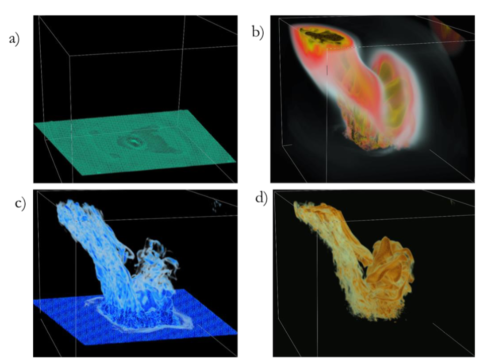
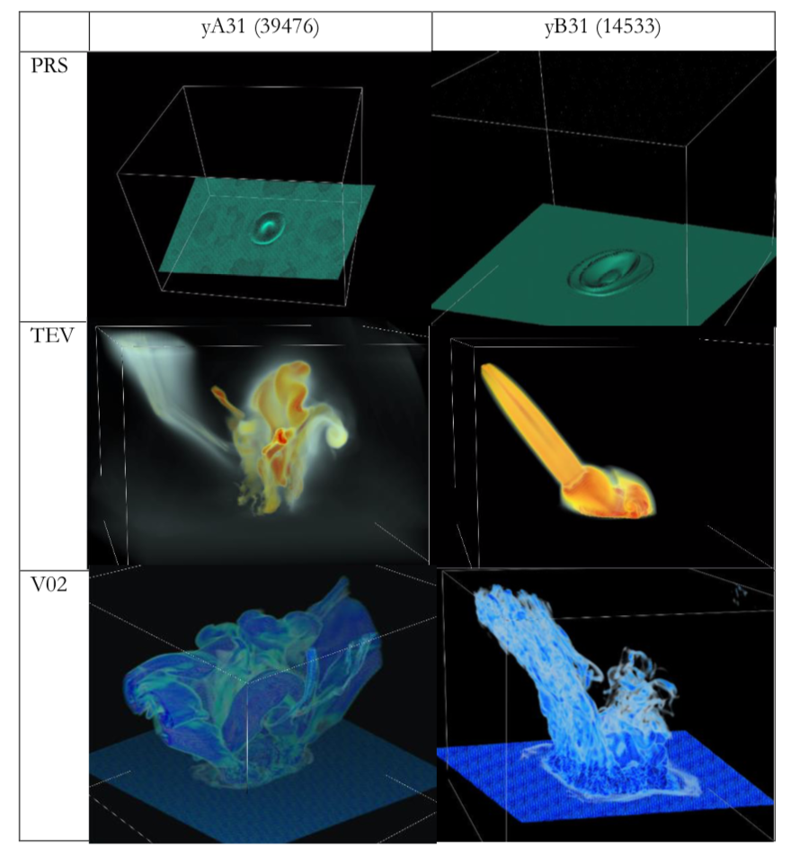
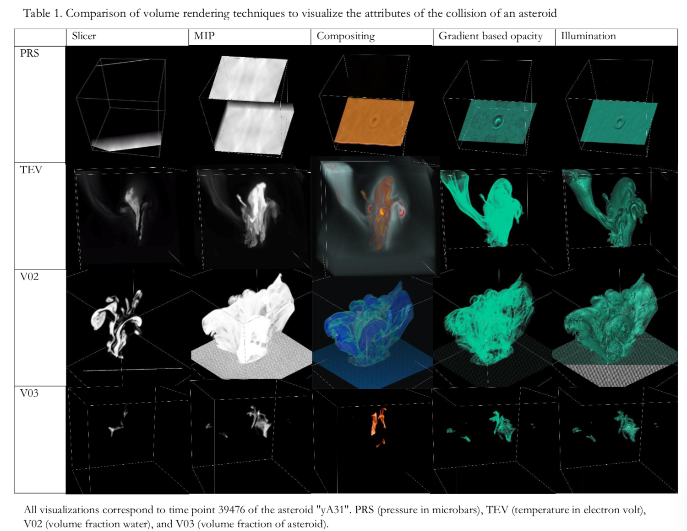
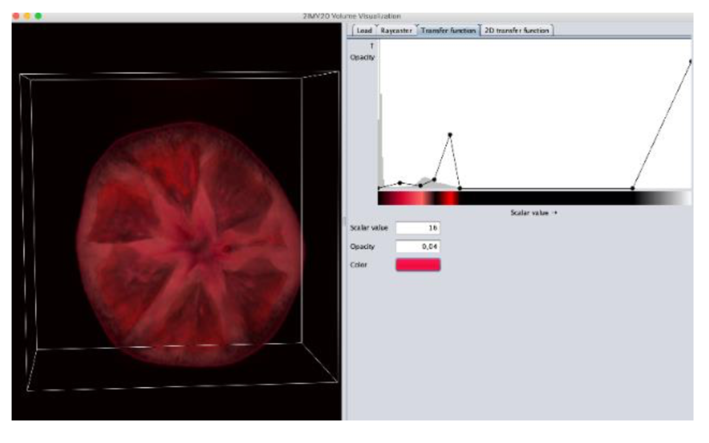
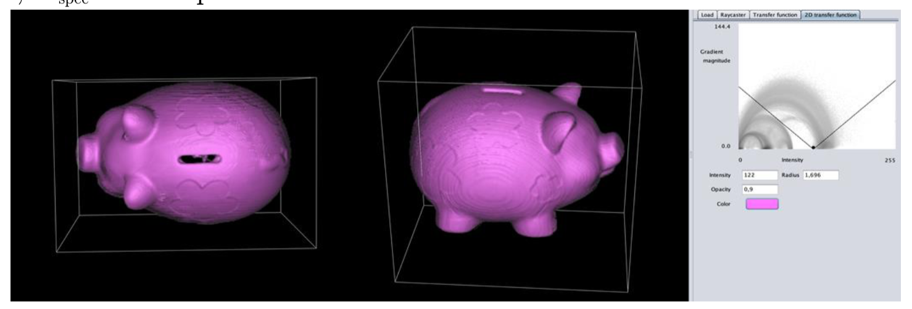

# This repo contains the code for the assignment 1 of visualization

 We developed a volume renderer based on a raycasting approach. We were provided with the skeleton application code, which provides a set-up of the whole graphics pipeline, a reader for volumetric data, and a slice-based renderer. The main task was to extend this to a full-fledged raycaster.
 
 __1.- Ray casting:__ Tri-linear interpolation of samples along the viewing ray. __MIP and compositing ray functions__
 
 __2.- 2-D transfer functions__: gradient-based opacity weighting in your raycaster, as described in Levoy’s paper[1] 
 
 __3.- Implement Phong shadingillumination model__
 
 
 
## 1. Introduction
Volume visualization is related to volume data modeling, manipulation, and rendering. It enables the extraction of meaningful information from a massive amount of complex volumetric data through interactive graphics. In the present assignment, we are interested in volume rendering. It refers to a set of techniques taking a 3D volume and projecting it to a 2D representation. We explore the application of volume rendering methods to the display of volumetric data.
The following sections describe the implementation of Trilinear interpolation, Maximum Intensity Projection (MIP), Compositing, and 2-D transfer functions. Subsequently, the techniques are applied to simulation data of deep-water asteroids. Finally, we compare the strengths and weaknesses of each of the techniques.

## 2. Ray-casting
Based in the method slicer() in the class RaycastRenderer, we were asked to implement the following functionalities: 1) Tri-linear interpolation of samples along the viewing ray, 2) Maximum Intensity Projection (MIP), and 3) Compositing ray functions. Besides some considerations on 4) Responsiveness are included. These elements are explained in the following sections.

### 2.1 Trilinear interpolation
Interpolation is one of the components required for any ray-casting implementation. Trilinear interpolation estimates the value at a specific location considering the 8 voxels surrounding the interpolation point. In Figure 1, X represents the interpolation point; X0...7 are the 8 voxels surrounding X; α, β, and γ are the proportions [0,1] of the sample position in x, y, and z.

As discussed by Ray et al. (1999), the fact that 8 voxel values and several multiplications are required to calculate each interpolation point implies that for a very large dataset, billions of multiplications are required for each projection. In consequence, interactive projections demand considerable computational power. By extension, higher order interpolation can improve image quality, but it has a high computational cost. Nearest-neighbor interpolation is a cheaper alternative, although its quality is worse.
The trilinear interpolation was implemented in the method RaycastRenderer.getVoxel().

### 2.2 Maximum intensity projection (MIP)
This method projects the voxel with maximum intensity falling in the path of the viewing ray. MIP was implemented by extending the RaycastRenderer.slicer() method to create a new method called RaycastRenderer.mip() which add a third loop that handles the depth of the vector (z-axis). 

### 2.3 Compositing
Compositing is a ray casting technique which is based on the accumulation of colors weighted by opacity. For each voxel value, the color and opacity contributions are extracted from locations along a ray to produce a final color for display. The new composite color is computed by multiplying the voxel color and opacity and adding to the multiplication of the previous composite color and opacity.

### Some results:

[1] M. Levoy. Display of surfaces from volume data. IEEE Computer Graphics and Applications, 8(3):29–37, 1988.
